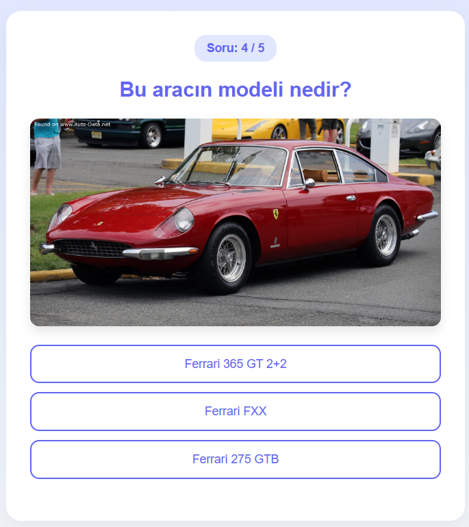

# 🚗 Araba Model Tahmin Quiz Uygulaması

Bu proje, kullanıcıya rastgele bir araba görseli göstererek doğru modeli tahmin etmesini isteyen bir React + Node.js tabanlı quiz uygulamasıdır. Veriler RapidAPI üzerinden alınmaktadır.

## 📁 Proje Yapısı

```
car-quiz-app/
├── frontend/                  # Frontend uygulaması
│   ├── src/                   # Kaynak kodlar
│   │   ├── components/        # Bileşenler
│   │   │   └── Quiz.jsx       # Quiz bileşeni
│   │   ├── pages/             # Sayfalar
│   │   │   └── Home.jsx       # Ana sayfa
│   │   ├── styles/            # Stil dosyaları
│   │   │   └── quiz.css       # Quiz stilleri
│   │   ├── assets/            # Medya dosyaları
│   │   ├── App.jsx            # Ana uygulama bileşeni
│   │   ├── App.css            # Ana stil dosyası
│   │   ├── main.jsx           # Uygulama giriş noktası
│   │   └── index.css          # Genel stil dosyası
│   └── package.json           # Frontend bağımlılıkları
│
├── backend/                   # Backend sunucusu
│   ├── server.js              # Express sunucu kodu
│   ├── routes/                # API rotaları
│   │   └── quizRoutes.js      # Quiz endpoint'leri
│   ├── controllers/           # İş mantığı kontrolcüleri
│   │   └── quizController.js  # Quiz işlemleri                  
│   └── package.json           # Backend bağımlılıkları
│
└── README.md                  # Proje dokümantasyonu
```

## 🌟 Özellikler

- ✅ Gerçek araba görselleri ile rastgele 5 soruluk quiz
- ✅ Doğru/yanlış cevaplara göre anında geri bildirim
- ✅ Quiz sonunda skor ekranı
- ✅ "Tekrar oyna" ve "Quizi bitir" seçenekleri
- ✅ React + Express.js mimarisi

---

## 🛠️ Teknolojiler

### Frontend

- React
- Vite
- React Router

### Backend

- Node.js
- Express.js
- RapidAPI (Araba veritabanı)
- API: [Cars Database with Image - RapidAPI](https://rapidapi.com/eu-QaXsyBmEj/api/cars-database-with-image)

---

## 🚀 Başlangıç

### 1. Backend (API)

```bash
cd backend
npm install
```

#### `.env` dosyası oluştur ve aşağıdaki değerleri gir:

```
RAPIDAPI_KEY=your_rapidapi_key
RAPIDAPI_HOST=cars-database-with-image.p.rapidapi.com
```

```bash
npm start
# veya
node server.js
```

> Backend `localhost:3001`'de çalışacaktır.

---

### 2. Frontend

```bash 
cd frontend
npm install
npm run dev
```

> Frontend `localhost:5173`'te çalışacaktır.

---

## 📸 Görsel 



---

## 📝 Notlar

- API key almak için [RapidAPI](https://rapidapi.com) üzerinden `Cars Database with Image` API'sine abone olmanız gerekir.

---


## 📧 İletişim

- 📧 E-posta: bilalgnc34@gmail.com
- 🔗 LinkedIn: [Bilal Genç](https://www.linkedin.com/in/bilalgnc/)
- 💻 GitHub: [genccbilal](https://github.com/genccbilal/)